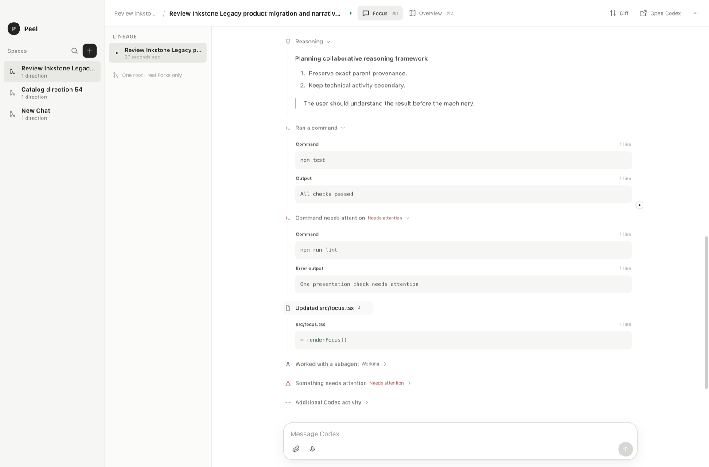
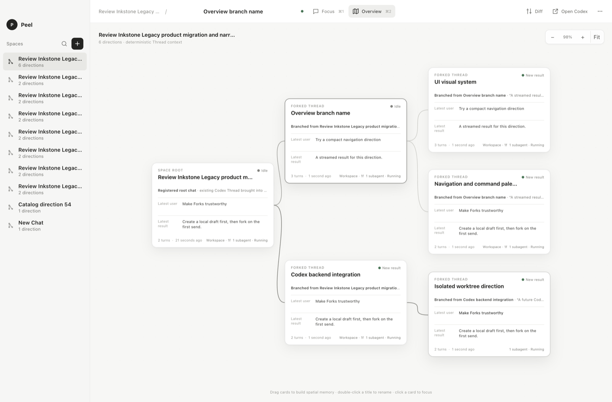

# Peel

**A spatial workspace for real Codex forks.**

Codex owns the conversation. Peel makes its branches visible.

Peel is a macOS desktop app for people who use Codex on real projects and outgrow a flat list of chats. Each **Space** starts from one real Codex Thread and grows only when you fork a completed turn. **Focus** is where you keep working in the conversation; **Overview** is where you see how the work branched, find an older direction, and return to it with its context intact.

> **Status:** v0.1 is a local Apple-silicon dogfood build. The core implementation and automated reliability gates are complete; human spatial-utility dogfood is still active. The app is not signed or notarized for public distribution.

## Focus on the conversation

Focus keeps the current Codex chat primary while a compact lineage rail shows where the Thread came from and which nearby branches need attention. Markdown, code, reasoning, commands, file changes, approvals, attachments, streaming, errors, and unknown Codex activity remain readable without turning Peel into an execution dashboard.



## See the shape of the work

Overview removes the Transcript and Composer and shows the complete Space. Cards use deterministic Codex facts—title, parent, fork point, latest user message and result, status, worktree, changed files, and subagent activity. Positions stay stable unless you move them.



## The core loop

1. Start a real new Codex Chat, or search and open an existing one.
2. Work normally in Focus.
3. Peel a direction from any completed turn. Nothing durable is created until the first message is sent.
4. Continue in the current workspace or create a dedicated worktree.
5. Use Lineage or Overview to find a non-current branch and continue it later.

A Space has one root and real Codex Fork descendants. It is not a free-form graph, and unrelated chats cannot be attached to fabricate a relationship.

## What v0.1 includes

- Direct New Chat and fast paginated search across existing Codex Threads.
- A full-fidelity Focus surface with per-Thread Draft and Scroll restoration.
- Exact-turn Forks, precise Parent return, manual naming, and recoverable first-send failures.
- Stable Overview cards with real Fork edges, drag, pan, zoom, Fit, and tested 30–50-node layouts.
- Current Workspace or New Worktree at first send, plus a lightweight Diff against local `main`.
- Voice Dictation that inserts editable text into the current Draft and never sends automatically.
- Approval, attention, failure, changed-file, and folded subagent signals.
- Restart recovery from Codex-owned Thread state plus Peel-owned spatial state.
- An explicit **Open Codex** escape hatch for every Thread.

## Product boundary

| Codex owns | Peel owns |
| --- | --- |
| Thread IDs, Transcripts, Turns and Items | Space membership and real Fork-edge records |
| Thread names, runtime status and approvals | Exact fork-turn anchors and last-viewed state |
| Working directory, worktree and Git facts | Card and camera positions, collapsed state |
| Subagent Threads and execution results | Local Fork drafts, Composer drafts and Scroll |

Peel deliberately does **not** provide arbitrary graph editing, Project-first navigation, a Git branch manager, commit/push/PR workflows, a test dashboard, an agent control room, or automatic semantic summaries presented as fact.

### Voice today

Peel preflights the Codex App Server Realtime session before opening the microphone. On the currently verified Codex `0.149` runtime, the Realtime schema is present but a ChatGPT/SIWC-authenticated session is rejected because that path still requires API-key authentication. Peel does not ask for, inherit, or store an independent API key to bridge that gap; it quietly uses its replaceable native Apple Speech adapter instead. Both paths only update the editable Draft.

## Run it locally

### Requirements

- Apple-silicon macOS
- Node.js 22 or newer
- Codex CLI with App Server support, authenticated for local use
- Git
- Apple Command Line Tools, used to build the native Speech helper

### Install and launch

```sh
git clone https://github.com/waynewangyuxuan/Peel.git
cd Peel
npm install --legacy-peer-deps
npm run start:desktop
```

`start:desktop` builds, packages, and opens the production Electron app. The bundle is written to:

```text
apps/desktop/out/Peel-darwin-arm64/Peel.app
```

Voice Dictation requests microphone and speech-recognition permissions when the selected engine first needs them. Capture, permission, and recognition failures leave the existing Draft unchanged.

### Build and verify

```sh
npm run build
npm test
npm run test:e2e --workspace @peel/desktop
npm run package:desktop
npm run verify:package --workspace @peel/desktop
```

The Electron journey uses isolated Codex and Speech fixtures plus a disposable Git repository. Package verification launches the exact built bundle outside Vite, checks the native helper and privacy strings, and proves that an edited Draft survives a full restart.

## Repository map

| Path | Purpose |
| --- | --- |
| [`apps/desktop`](apps/desktop/README.md) | Electron shell, renderer, native Voice helper, packaging and end-to-end journey |
| [`packages/codex-app-server`](packages/codex-app-server/README.md) | Typed local Codex transport, capability gating and reconstructable Thread state |
| [`packages/git-workspace`](packages/git-workspace/README.md) | Read-only Git facts, safe optional worktree creation and lightweight Diff data |
| [`.vibehub`](.vibehub/) | Checked-in product Context, delivery Tickets, Evidence and Outcomes |
| [`docs/architecture`](docs/architecture/) | Architecture decisions |
| [`docs/product/source`](docs/product/source/README.md) | Preserved product sources that informed the active contracts |

## Product sources

- [Original product requirements](docs/product/source/spatial-thread-workspace-prd-v0-original.md)
- [Original runnable interaction Demo](docs/product/source/peel-demo-v0-original.html)
- [Desktop implementation and packaging notes](apps/desktop/README.md)
- [Codex App Server adapter boundary](packages/codex-app-server/README.md)
- [Git Workspace adapter boundary](packages/git-workspace/README.md)

The original PRD and Demo are preserved as source material. Active checked-in Product Context supersedes their earlier Project-first and unrelated-chat registration assumptions.

## Roadmap

v0.2 begins only after the core spatial-return loop is proven in dogfood. Its current direction is scale and continuity: keyboard-first Overview navigation, Space search, pinning, reversible subtree collapse/parking, recent filtering, explicit Tidy, and honest discovery of externally created Codex Forks. Codex Project association remains an optional capability-gated experiment, not a dependency of the Space model or the v0.2 release.

